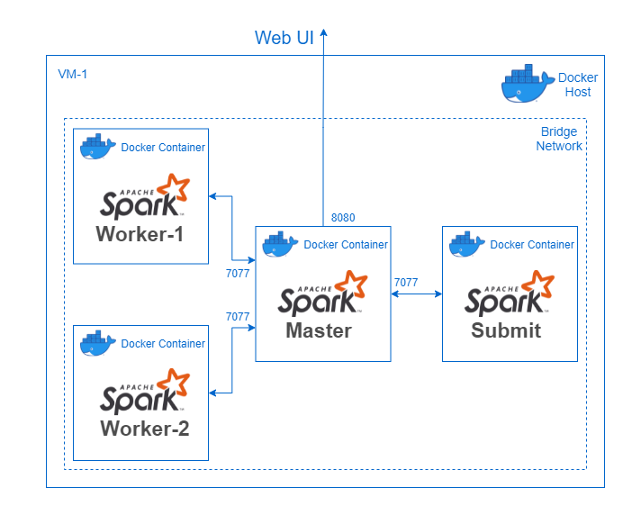
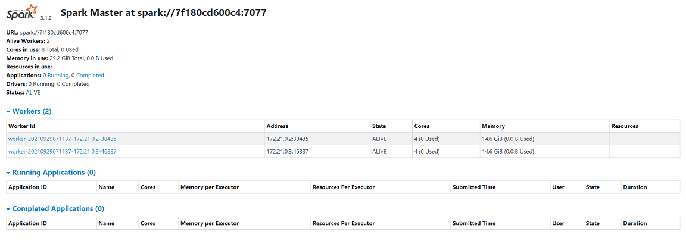
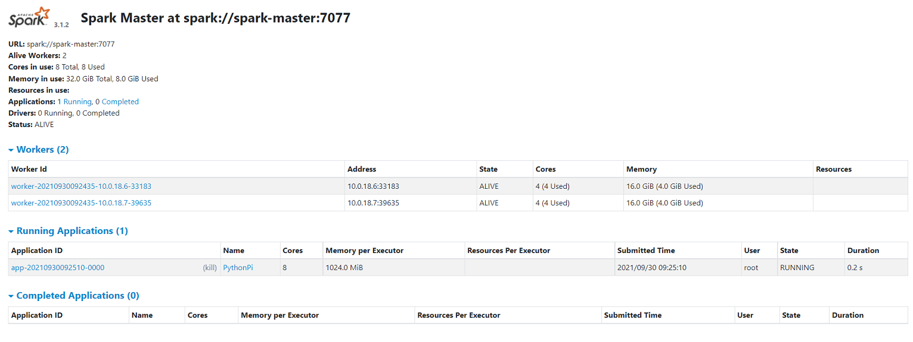

# Spocker : Spark *on* Docker

<p align="center">
    
</p>


Containerized Spark deployment using Docker.<br>
This repository refers to containerized Spark as Spocker.<br>
*Kubernetes should be preferred as the orchestrator for prodcution systems over Docker-Swarm.*<br><br>


# Single-Host Spark using Docker

Deploy containerized Spark (Standalone) inside a single machine (host) using Docker.

## Requirements

- Docker - on (all) Linux Machine(s)

Install docker from [here](https://docs.docker.com/engine/install/) if required.

To deploy and run Spark (Standalone) inside a single machine(host), run the following commands.
This runs the spark-master, and spark-worker containers on the same machine/docker-host.


## Steps

1. Clone this repo.
2. Execute the docker compose file.
3. Submit a spark-job to the Spark cluster.

## 1. Clone this repository
```bash
git clone https://github.com/elaaf/spocker.git
```

```bash
cd spocker
```

## 2. Execute the docker-compose.yml
```bash
docker-compose -f spark/single-host-docker-compose/docker-compose.yml up
```
This will pull the latest images for spark-master and spark-worker.
A [docker bridge network](https://docs.docker.com/network/bridge/) named `spark-net` will be created and joined by the containers.



<br>

Three containers will be started on the host-machine:
- 1 x Spark-Master: WebUI @ Your-Machine-IP:8080
- 2 x Spark-Worker WEBUI @ Your-Machine-IP:8081 and Your-Machine-IP:8082


If the deployement was successful, the Spark WebUI should be accessible @ YOUR-IP:8080 and should look something like this:



## 3. Submit a job to the single-host Spark cluster

Start the spark-submit container, providing the SPARK_MASTER_URL (optional for single-host: defaults to `spark://spark-master:7077`) and JOB_PATH.<br>
The contianer will run till the submitted spark-job's life, hosting the spark-driver inside it.

```bash
docker run -it \
--network spark-net \
--mount type=bind,src=$(pwd),dst=/spocker/ \
-e JOB_PATH=/spocker/spark/spark-test-job/spark_submit_test_pi.py \
elaaf/spark-submit
```
The `--mount` command will mount (bind-type) the current directory at the path `/spocker/` inside the spark-submit docker container.<br>
This allows the container to access the code/py-files inside the mounted directory.<br>
The Spark WebUI will show a running application and will move it to completed on completion.


# Multi-Host Spark using Docker Swarm

Deploy containerized Spark (Standalone) up-and-running on a cluster using  Docker Swarm which is a multi-host container orchestartion tool.


## Requirements
- Multiple nodes/VMs (atleast 2) on the same network, with internet access on atleast one VM.
- Docker installed on each node/VM.

## Steps

1. Clone this repository
2. Setup a Docker swarm on the connected VMs.
3. Deploy the dockerized Spark `stack` from the Docker Swarm Manager/Leader.
4. Submit a spark-job to the Spark cluster.

## 1. Clone this repository

Designate one of the node/VM as `Swarm Manager/Leader`.<br>
***Be mindful that most commands will be executed ONLY on the Swarm Manager/Lead node/VM.<br>
Docker will automatically propogate the required data to the Swarm Workers Nodes.***<br><br>

Clone this repository:

```bash
git clone https://github.com/elaaf/spocker.git
```

```bash
cd spocker
```

## 2. Setup Docker Swarm

From the node/VM designated as swarm Manager/Leader, initialize docker swarm:

```docker
docker swarm init
```

This will initialize the node/vm as the Swarm Leader, along with an `join-token` to join the swarm:


* On all the other nodes/VMs run the following command to join the Docker swarm:

```docker
# Run on all other nodes/VMs except, Swarm Leader
docker swarm join --token <swarm-join-token> <swarm-leader-ip>:<port>
```

* Verify that all nodes/VMs have joined the Swarm, run:

```docker
docker node ls
```

You should get an output similar to below, listing all the nodes in the Swarm and indicating the Swarm Leader:


## 3. Deploy Spark to Docker Swarm

Spark can be deployed across all nodes/VMs inside the Docker Swarm by executing the compose file with the following command:
NOTE: Execute the command ONLY on the Swarm Leader/Manager

```docker
# Run this ONLY on the Swarm Leader 
docker stack deploy spocker --compose-file spark/docker-compose.yml
```

This will start the following containers :
- 1 X Spark-Master: WebUI @ <SWARM-LEADER-IP>:8080
- 1 X Spark-Worker on each Swarm Worker Node: WEBUI @ <WORKER-NODE-IP>:8080


NOTE: This `docker stack` deployment configuration connects the containers to a new *swarm-scope* `overlay network` called *spark-net*.
More details about Docker Overlay Networks [here](https://docs.docker.com/network/overlay/).

## 4. Submit a Spark job


Start the spark-submit container, providing the SPARK_MASTER_URL and JOB_PATH.<br>
The contianer will run till the submitted spark-job's life, hosting the spark-driver inside it.

Run the following command on the `Swarm Leader`:

```bash
docker run -it \
--network spark-net \
--mount type=bind,src=$(pwd),dst=/spocker/ \
-e JOB_PATH=/spocker/spark/spark-test-job/spark_submit_test_pi.py \
-e SPARK_MASTER_URL=spark://spark-master:7077 \
-e DRIVER_CORES=1 \
-e DRIVER_MEMORY=4g \
-e NUM_EXECUTORS=1 \
-e EXECUTOR_CORES=1 \
-e EXECUTOR_MEMORY=1g \
elaaf/spark-submit
```
The `--mount` command will mount (bind-type) the current directory at the path `/spocker/` inside the spark-submit docker container.<br>
This allows the container to access the code/py-files inside the mounted directory.<br>



<br>
The Spark WebUI will show a running application (similar to the above image) and will move it to completed on completion.


## TO-DO:
* Implement Containerized Hadoop (HDFS, YARN)
* Integrate Containerized Spark (YARN) and Hadoop (HDFS)