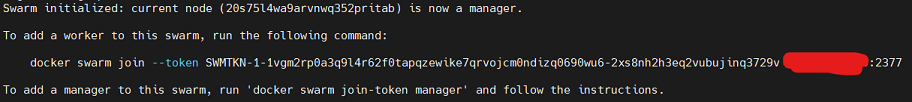
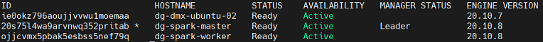
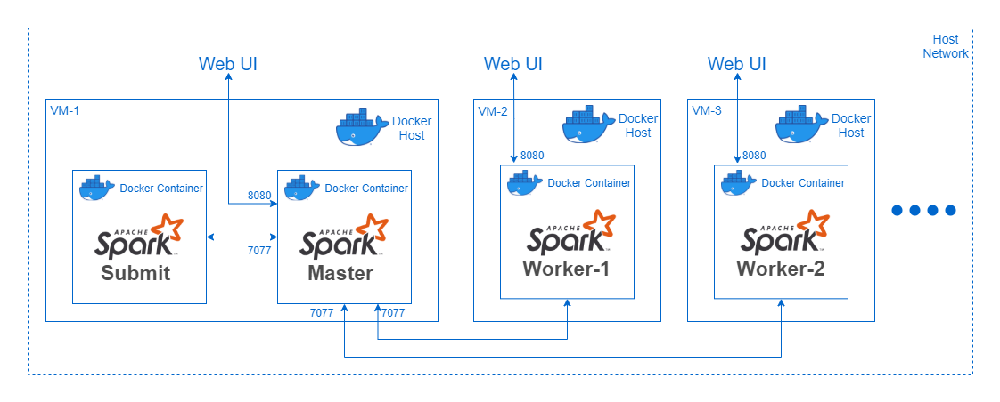

# Spocker - Multi-Host Dockerized Spark using Docker Swarm

This a step-by-step guide to get a containerized Spark (Standalone) up-and-running on a cluster using  Docker Swarm which is a multi-host container orchestartion tool.


## Requirements
- Multiple nodes/VMs (atleast 2) on the same network, with internet access on atleast one VM.
- Docker installed on each node/VM.

## Steps

1. Setup a Docker swarm on the connected VMs.
2. Deploy the dockerized Spark `stack` from the Docker Swarm Manager/Leader.
3. Submit a spark-job to the Spark cluster.


## 1. Setup Docker Swarm

* Designate one of the node/VM as swarm Manager/Leader. On the Swarm Leader run:

```docker
docker swarm init
```

This will initialize the node/vm as the Swarm Leader, along with an `join-token` to join the swarm:



* On all the other nodes/VMs run the following command to join the Docker swarm:

```docker
# Run on all other nodes/VMs except, Swarm Leader
docker swarm join --token <swarm-join-token> <swarm-leader-ip>:<port>
```

* Verify that all nodes/VMs have joined the Swarm, run:

```docker
docker node ls
```

You should get an output similar to below, listing all the nodes in the Swarm and indicating the Swarm Leader:



## 2. Deploy Spark to Docker Swarm

Spark can be deployed across all nodes/VMs inside the Docker Swarm by executing the compose file with the following command:
NOTE: Execute the command ONLY on the Swarm Leader/Manager

```bash
# Create an environment variable `SPARK_MASTER_IP`, on the Swarm Leader, when the Spark Master will run
export SPARK_MASTER_IP=$(hostname -I | awk '{print $1}')
```


```docker
# Run this ONLY on the Swarm Leader 
docker stack deploy spocker --compose-file spark/docker-compose.yml
```

This will start the following containers :
- 1 X Spark-Master: WebUI @ <SWARM-LEADER-IP>:8080
- 1 X Spark-Worker on each Swarm Worker Node: WEBUI @ <WORKER-NODE-IP>:8080



NOTE: This `docker stack` deployment configuration exposes the containers to the `host network` i.e. no software network emulation is performed by docker. It may be noted that this deployment can also fully function with an `overlay network`.

## 3. Submit a Spark job


Start the spark-submit container, providing the SPARK_MASTER_URL and JOB_PATH.<br>
The contianer will run till the submitted spark-job's life, hosting the spark-driver inside it.

Run the following command on the `Swarm Leader`:

```bash
docker run -it \
--network host \
--mount type=bind,src=$(pwd),dst=/spocker/ \
-e JOB_PATH=/spocker/spark/spark-test-job/spark_submit_test_pi.py \
-e SPARK_MASTER_URL=spark://$SPARK_MASTER_IP:7077 \
-e DRIVER_CORES=1 \
-e DRIVER_MEMORY=4g \
-e NUM_EXECUTORS=1 \
-e EXECUTOR_CORES=1 \
-e EXECUTOR_MEMORY=500m \
elaaf/spark-submit
```
The `--mount` command will mount (bind-type) the current directory at the path `/spocker/` inside the spark-submit docker container.<br>
This allows the container to access the code/py-files inside the mounted directory.<br>
The Spark WebUI will show a running application and will move it to completed on completion.